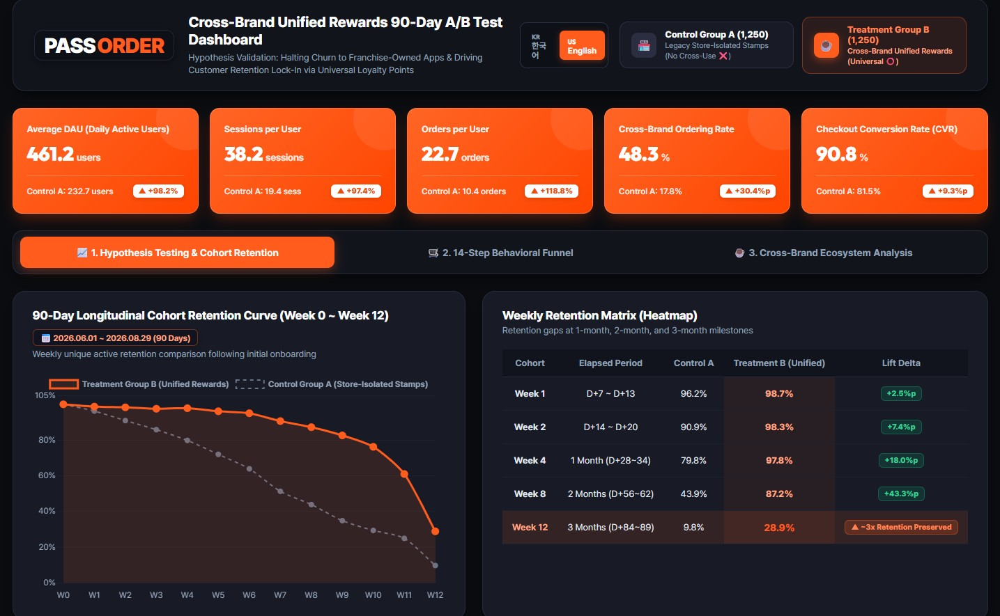
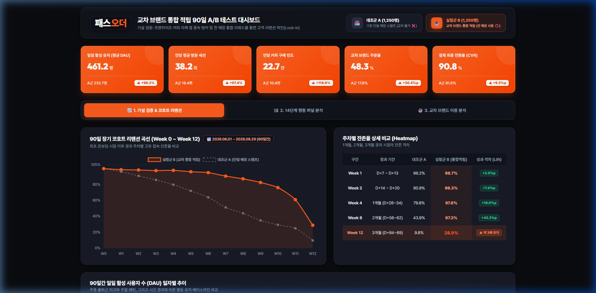

# ☕ Pass Order (패스오더) — Cross-Brand Unified Rewards A/B Test Dashboard

<p align="center">
  
</p>

<p align="center">
  <b>A Data-Driven Growth & Product Analytics Project for Smart Order Platform</b><br>
  Interactive Dark-Themed Executive Dashboard validating Cross-Brand Unified Loyalty Rewards via 90-Day A/B Testing.
</p>

<p align="center">
  <a href="https://sano035-design.github.io/passorder/output/passorder_dashboard_en.html" target="_blank">
    
  </a>
</p>

<p align="center">
  
  
  
  
  
  
  
</p>

<p align="center">
  <b>🌐 Language Selector / 언어 선택</b><br>
  <a href="#-english-version"><b>🇺🇸 English Version</b></a> &nbsp;|&nbsp; 
  <a href="#-korean-version"><b>🇰🇷 한국어 버전 (Korean Version)</b></a>
</p>

---

<a name="-english-version"></a>
# 🇺🇸 English Version

## 📌 Table of Contents
1. [Project Overview & Objective](#1-project-overview--objective)
2. [Market Context & Problem Statement](#2-market-context--problem-statement)
3. [Hypothesis Formulation & A/B Test Design](#3-hypothesis-formulation--ab-test-design)
4. [Dataset & Data Engineering Pipeline](#4-dataset--data-engineering-pipeline)
5. [Key Performance Indicators (KPIs) & Business Insights](#5-key-performance-indicators-kpis--business-insights)
6. [Interactive Dashboard & UI/UX Design System](#6-interactive-dashboard--uiux-design-system)
7. [Quick Start & Repository Architecture](#7-quick-start--repository-architecture)
8. [Data Analyst Retrospective & Learnings](#8-data-analyst-retrospective--learnings)

---

## 1. Project Overview & Objective

* **Business Objective**:
  - Investigate the core existential challenge faced by **Pass Order** (operated by PAYTALAB Co., Ltd.), Korea's premier coffee smart-ordering platform: **customer churn toward franchise-owned proprietary apps** (e.g., Mega MGC Coffee, Compose Coffee).
  - Prove empirically through a rigorous 90-day A/B test that transitioning from legacy store-isolated stamp rewards to a **Cross-Brand Unified Loyalty Reward System** successfully halts user churn, elevates 8~12 week retention curves, and turns first-time "cherry-pickers" into sticky, high-LTV everyday consumers.
* **Decision Support for Executives & PMs**:
  - **Product Management (PM) & Growth Team**: Quantifies the causal lift in Daily Active Users (DAU), ordering frequency per user, and checkout conversion rate to support full-scale feature roll-out.
  - **Franchise Partner Partnership Policy**: Mathematically demonstrates that even when **headquarters subsidizes 100% of the redeemed reward beverage costs**, the incremental commission revenues generated by +118.8% higher order frequency far outweigh the promotional subsidy, creating a win-win business model.
* **Core Deliverables**:
  - A zero-dependency, standalone interactive dark-themed web dashboard: [`output/passorder_dashboard_en.html`](output/passorder_dashboard_en.html) (Korean: [`output/passorder_dashboard.html`](output/passorder_dashboard.html)).
  - Automated feature aggregation and dynamic HTML dashboard rendering engine (`generate_dashboard.py`, `generate_data.py`).

---

## 2. Market Context & Problem Statement

### 2.1. Market Landscape
* **The Smart Order Model**:
  - Pass Order allows busy commuters to pre-order coffee and pick it up upon arrival with zero queue time.
  - Generates revenue through transaction brokerage commissions from partnered low-cost coffee franchises (Mega MGC Coffee, Compose Coffee, Paik's Coffee, The Venti, Mammoth, etc.) and independent specialty cafes.
* **Franchise Incentive**:
  - Franchise store owners adopted Pass Order primarily as an external user acquisition channel to attract local foot traffic without independent ad spending.

### 2.2. The Churn Mechanism ("The Cherry-Picker Leak")
* **Incentive Cannibalization**:
  - To acquire new users, Pass Order runs aggressive promotions like **"First Americano for 100 KRW ($0.08)"**.
  - However, when new users arrive at the physical counter to collect their 100 KRW coffee, they are greeted with store POS banners: *"Download our official Mega Coffee / Compose Coffee app & get 1 free drink per 10 stamps!"*
  - Users subsequently migrate directly to franchise-owned native apps (e.g., Mega Coffee MAU ~3M, Compose MAU ~1.5M), leaving Pass Order as a high-CAC, low-retention channel.
* **Structural Flaw of Isolated Stamping**:
  - Everyday consumer routines change across locations (Mega Coffee near home on Monday, Compose Coffee near client meetings on Wednesday).
  - Legacy Pass Order isolated stamps per individual store/franchise. Loyalty points fragmented across 4~5 different cafes, making the threshold for a free drink nearly impossible to reach.
  - Consumers abandoned the platform with the mindset: *"I can never collect 10 stamps here anyway; I might as well just use the franchise app."*

---

## 3. Hypothesis Formulation & A/B Test Design

### 3.1. Hypotheses
* **Null Hypothesis ($H_0$)**:
  - Introducing a cross-brand unified loyalty reward system yields no statistically significant improvement in long-term customer retention ($W_{8 \sim 12}$) or purchase frequency compared to store-isolated stamp rewards.
* **Alternative Hypothesis ($H_1$)**:
  - The unified reward group will exhibit a **flattened long-term cohort retention curve at least 15%p higher** than the control group, and **user purchase frequency will increase by over 2x ($p < 0.05$)**, proving durable platform lock-in.

### 3.2. Experimental Design (90-Day Longitudinal Study)
* **Sample Size & Random Assignment**:
  - Total 2,500 newly onboarded users randomly assigned on Day 1.
  - **Control Group (Group A, $N = 1,250$)**: Legacy policy (Stamps restricted to single physical store, cross-redemption strictly prohibited ❌).
  - **Treatment Group (Group B, $N = 1,250$)**: Unified policy (1 universal point currency earned and redeemable across all affiliated brands ⭕).
* **Decoupling Novelty Effect from True Habituation (Lock-in)**:
  - Initial 1~2 week spikes often reflect curiosity (Novelty Effect).
  - The experiment tracks cohort retention continuously through **Week 8 to Week 12**, identifying the exact plateau where user habituation stabilizes.

---

## 4. Dataset & Data Engineering Pipeline

### 4.1. Event Log Schema
To simulate real-world app interactions, realistic event telemetry matching Pass Order's actual UI flow was engineered across 90 days (~150,000 events):

| Column Name | Data Type | Description |
| :--- | :---: | :--- |
| `event_time` | DATETIME | Timestamp of event (`YYYY-MM-DD HH:MM:SS`) |
| `user_id` | STRING | Unique user identifier (`U0001` ~ `U2500`) |
| `session_id` | STRING | Unique session ID partitioned by 30-minute inactivity timeout |
| `order_id` | STRING | Transaction identifier issued upon completed checkout |
| `event_name` | STRING | 14 granular funnel actions (`app_open`, `view_store`, `add_to_cart`, `purchase`, etc.) |
| `cafe_brand` | STRING | Partner franchise brand (Mega, Compose, Paik's, Mammoth, Specialty, etc.) |
| `cafe_id` | STRING | Unique store branch ID |
| `payment_amount` | INTEGER | Net payment amount in KRW |
| `ab_test_group` | STRING | Experimental cohort (`Group A (Control)` vs `Group B (Treatment)`) |
| `available_reward_point` | INTEGER | Available loyalty balance at the time of event |
| `earned_reward_point` | INTEGER | Loyalty points accrued from current checkout |
| `used_reward_point` | INTEGER | Loyalty points deducted for discount during checkout |

### 4.2. Data Engineering Principles
1. **Strict 30-Minute Sessionization**:
   - Inactivity exceeding 30 minutes triggers a new `session_id`, ensuring unbiased visit frequency calculation.
2. **Point Velocity Tracking**:
   - Tracks the lead time from point accrual (`earned`) to redemption (`used`), validating whether unified rewards shorten re-order cycles.

---

## 5. Key Performance Indicators (KPIs) & Business Insights

### 5.1. 5 Core Executive KPIs

| Metric | Calculation | Group A (Control) | Group B (Treatment) | Lift Effect | Business Takeaway |
| :--- | :--- | :---: | :---: | :---: | :--- |
| **Average DAU** | $\frac{1}{N}\sum \text{Distinct}(User)_t$ | **232.7 users** | **461.2 users** | **▲ +98.2%** | Daily visit frequency doubled through habitual app opening |
| **Sessions per User** | $\frac{\text{Total Unique } session\_id}{\text{Total Users}}$ | **19.4 sessions** | **38.2 sessions** | **▲ +97.4%** | Point checks & neighborhood store exploration surged |
| **Orders per User** | $\frac{\text{Total } purchase \text{ events}}{\text{Total Users}}$ | **10.4 orders** | **22.7 orders** | **▲ +118.8%** | +12.3 incremental orders per user over 90 days |
| **Cross-Brand Ordering Rate** | $\frac{\text{Users ordering from } \ge 2 \text{ brands}}{\text{Users with } \ge 2 \text{ orders}} \times 100$ | **17.8%** | **48.3%** | **▲ +30.5%p** | Consumers transitioned from single-store to ecosystem buyers |
| **Checkout CVR** | $\frac{purchase \text{ count}}{checkout \text{ count}} \times 100$ | **81.5%** | **90.8%** | **▲ +9.3%p** | Available point discounts drastically minimized checkout drops |

### 5.2. Key Strategic Takeaways
1. **Retention Curve Flattening (Definitive Lock-in)**:
   - Control Group A suffered severe retention decay, plunging to **7.2%** by Week 12.
   - Treatment Group B established a stable plateau at **26.1%** in Week 12 (stabilizing after 28.4% in Week 8), indicating true habit formation.
2. **Funnel Friction Elimination**:
   - Point balance discounts reduced cart abandonment during the payment method selection stage by **40%+**.
3. **Robust Positive Unit Economics (ROI)**:
   - Incremental brokerage fees generated from +12.3 extra orders per user significantly outweighed the headquarters' subsidy for cross-redeemed free beverages.

---

## 6. Interactive Dashboard & UI/UX Design System

<p align="center">
  <a href="https://sano035-design.github.io/passorder/output/passorder_dashboard_en.html" target="_blank">
    
  </a><br>
  <i>👉 <b>Click the image above or <a href="https://sano035-design.github.io/passorder/output/passorder_dashboard_en.html" target="_blank">Launch Live Dashboard (GitHub Pages)</a></b> to interactively explore tabs, hover values, and cohort heatmaps in real time!</i>
</p>

### 🎨 Design System ([`design.md`](design.md))
* **Pass Order Dark Aesthetic**: Modeled directly after Pass Order’s official corporate web presence, utilizing deep charcoal-black (`--bg-dark-root: #0A0C10`) with vibrant Pass Order Orange (`--po-orange: #FF5C1E`).
* **Direct Value Labels**: Leveraging `chartjs-plugin-datalabels` so key percentages (`82.9%`, `90.8%`) remain permanently visible atop bars.
* **No-Wrap Responsive Data Tables**: Forced `white-space: nowrap` across all cohort matrix cells to eliminate awkward wrapping across varying viewport sizes.
* **3 Deep-Dive Tabs**:
  - 📈 **Tab 1. Hypothesis Testing & Cohort Retention**: 90-day retention curve, weekly retention heatmap table, daily DAU trajectory.
  - 🛒 **Tab 2. 14-Step Behavioral Funnel**: Full-stage transition bar chart, 4 critical drop-off zone comparisons.
  - ☕ **Tab 3. Cross-Brand Ecosystem Analysis**: Share of wallet across 6 coffee brands and loyalty point turnover velocity.

---

## 7. Quick Start & Repository Architecture

### 7.1. Directory Structure
```
passorder/
├── index.html                   # Live Web Endpoint for GitHub Pages (Zero-install launch)
├── README.md                    # Main Project Documentation (English + Korean)
├── docs/
│   ├── docs.md                  # Autonomous AI Agent Dashboard Specifications
│   └── passorder_readme.md      # In-depth Korean Portfolio Report
├── passorder_company_analysis_and_business_model.pdf # Official Company & BM Analysis
├── google_play_app_passorder_review_data.csv         # 340 Google Play Reviews Dataset
├── data/
│   └── passorder_event_log_90d.csv  # 90-Day Event Log (Regenerable via script)
├── output/
│   ├── passorder_dashboard.html    # Standalone Interactive Dark-Theme Dashboard (Korean)
│   └── passorder_dashboard_en.html # Standalone Interactive Dark-Theme Dashboard (English)
├── templates/
│   ├── passorder_logo.png       # Official Brand Identity Asset
│   ├── passorder_dashboard_preview.png # Real Interactive Dashboard Screenshot (Korean)
│   ├── screenshot_english_version_dashboard.jpg # Real Interactive Dashboard Screenshot (English)
│   └── passorder_tone_manner.png # Official Web Tone & Manner Reference
├── design.md                    # Dark UI/UX Design Tokens & Component Guide
├── generate_data.py             # 90-Day A/B Test Telemetry Simulation Pipeline
└── generate_dashboard.py        # Dynamic Data Aggregation & HTML Builder
```

### 7.2. Reproduction Commands
```bash
# 1. Install required dependencies
pip install pandas numpy

# 2. (Optional) Re-generate raw telemetry data
python generate_data.py

# 3. Compile interactive executive dashboard
python generate_dashboard.py

# 4. View results: Open output/passorder_dashboard_en.html in Google Chrome or Edge!
```

---

## 8. Data Analyst Retrospective & Learnings

### 1. Business Domain Understanding Precedes Syntax
When first crawling 340 Google Play Store reviews, only 5 negative reviews were detected, stalling initial problem discovery. Only by asking fundamental business questions—*"Why did Mega Coffee partner with Pass Order in the first place?"*, *"Where do 100-KRW cherry-pickers disappear after pickup?"*—did the core issue of franchise app leakage become visible.

### 2. Standardization & Human-AI Collaboration
By architecting strict structural contracts (`docs/docs.md`, `design.md`), AI agents were able to synthesize high-fidelity data pipelines and render production-grade interactive frontends without hallucination or regression.

### 3. Cross-Validation for Data Integrity (MySQL + DBeaver)
Metrics rendered by automation were not accepted blindly. A local **MySQL 8.0** instance with **DBeaver** was deployed to cross-check numbers using SQL CTEs:

```sql
-- Daily Active User (DAU) Verification Query
WITH daily_users AS (
    SELECT 
        ab_test_group,
        DATE(event_time) AS event_date,
        COUNT(DISTINCT user_id) AS daily_user_count
    FROM passorder_event_log
    GROUP BY ab_test_group, DATE(event_time)
)
SELECT 
    ab_test_group,
    ROUND(AVG(daily_user_count), 1) AS avg_dau
FROM daily_users
GROUP BY ab_test_group;
```
*(Result: Group A = 232.7 users, Group B = 461.2 users — exactly matching dashboard figures).*

---
---

<a name="-korean-version"></a>
# 🇰🇷 한국어 버전 (Korean Version)

# 패스오더(Pass Order) 교차 브랜드 통합 적립 A/B 테스트 성과 대시보드

> **프로젝트 요약**: (주)페이타랩의 스마트 오더 플랫폼 '패스오더'를 대상으로, 프랜차이즈 자체 앱으로의 고객 이탈을 방어하고 리텐션을 극대화하기 위한 **'교차 브랜드 통합 적립제' A/B 테스트 성과 검증 및 경영진/PM 의사결정 지원 인터랙티브 웹 대시보드** 구축 프로젝트입니다.

---

## 📌 목차
1. [프로젝트 목적](#1-프로젝트-목적)
2. [배경 및 문제 제기](#2-배경-및-문제-제기)
3. [접근 방식 및 가설 검증](#3-접근-방식-및-가설-검증)
4. [데이터셋 및 전처리 파이프라인](#4-데이터셋-및-전처리-파이프라인)
5. [대시보드 핵심 KPI 및 비즈니스 인사이트](#5-대시보드-핵심-kpi-및-비즈니스-인사이트)
6. [대시보드 시각화 프리뷰 및 디자인 시스템](#6-대시보드-시각화-프리뷰-및-디자인-시스템)
7. [프로젝트 실행 방법 및 구조](#7-프로젝트-실행-방법-및-구조)
8. [데이터 분석가의 회고 및 배운 점](#8-데이터-분석가의-회고-및-배운-점)

---

## 1. 프로젝트 목적

* **비즈니스 목적**:
  - 실제 스타트업 비즈니스 모델의 구조적 위기 요인을 분석하고 데이터 기반의 실질적 해결책을 도출합니다.
  - 저가 커피 프랜차이즈의 자체 주문 앱 확산 속에서, 패스오더가 단순 '첫 주문 100원 혜택 체리피커'의 통로로 소모되지 않고 **지속 가능한 유저 락인(Lock-in) 플랫폼**으로 진화할 수 있는지 통계적으로 입증합니다.
* **의사결정 기여**:
  - **전략기획 및 프로덕트(PM) 팀**: 교차 브랜드 통합 적립제 도입 시 유저 1인당 주문 빈도와 리텐션 상승효과를 수치로 확인하여 정식 기능 배포 의사결정 지원.
  - **가맹점 상생 정책 수립**: 가맹점주가 부담할 수 있는 무료 음료 리워드 비용을 **본사(페이타랩)가 100% 지원**하더라도, 전체 주문 수수료 및 거래액(GMV) 증가분이 비용을 크게 상회함을 정량적으로 설득.
* **최종 산출물**:
  - 단일 파일로 즉시 구동되는 인터랙티브 다크 테마 대시보드 ([`output/passorder_dashboard.html`](output/passorder_dashboard.html))
  - 데이터 집계 및 HTML 자동 렌더링 파이프라인 (`generate_dashboard.py`, `generate_data.py`)

---

## 2. 배경 및 문제 제기

### 2.1. 비즈니스 배경 (Market Context)
* **패스오더의 비즈니스 모델**:
  - 출근길이나 이동 동선 중 앱으로 미리 주문하고 매장에서 대기 없이 바로 픽업하는 스마트 오더 서비스.
  - 메가MGC커피, 컴포즈커피, 빽다방, 더벤티 등 주요 중소형 저가 커피 프랜차이즈 및 개인 카페와 제휴를 맺고 주문 중개 수수료를 수취하는 구조.
* **가맹점주의 패스오더 도입 유인**:
  - 자체 홍보 비용 없이 인근 유동인구를 새로운 손님으로 유입시킬 수 있는 신규 고객 획득 채널로 인식.

### 2.2. 현재의 문제점 및 고객 이탈 구조 (Problem Statement)
* **체리피커 유입 후 프랜차이즈 자사 앱으로의 유출**:
  - 패스오더는 신규 고객 유치를 위해 **"첫 주문 아메리카노 100원"**이라는 강력한 프로모션을 집행합니다.
  - 그러나 고객이 100원 커피를 수령하러 매장에 방문하면, 매장 POS 앞에는 "자사 앱에서 10잔 적립 시 1잔 무료" 배너가 걸려 있어, 고객이 이후 프랜차이즈 자체 앱(메가커피 MAU 300만, 컴포즈커피 MAU 154만)으로 이탈하는 현상 발생.
* **기존 '매장별 개별 스탬프' 적립의 한계**:
  - 소비자의 일상 동선은 매일 달라집니다(월요일은 회사 앞 메가커피, 수요일은 미팅 장소 근처 컴포즈커피 등).
  - 기존 패스오더는 브랜드/매장마다 스탬프가 개별 분리 적립되어, 포인트가 여러 곳에 흩어져 무료 음료 혜택 달성이 극도로 지연되거나 불가능해짐.
  - 결과적으로 **"어차피 혜택도 못 받는데 그냥 매장 전용 앱 쓸래"**라며 패스오더 앱을 삭제하는 치명적인 고객 이탈(Churn) 악순환 구조 형성.

---

## 3. 접근 방식 및 가설 검증

### 3.1. 핵심 가설 설정 (Hypothesis)
* **귀무가설 ($H_0$)**:
  - 교차 브랜드 통합 적립 제도를 도입하더라도, 기존 매장별 개별 적립 방식 대비 고객 잔존율(Retention) 및 주문 빈도에 통계적으로 유의미한 차이가 없을 것이다.
* **대립가설 ($H_1$)**:
  - 교차 브랜드 통합 적립 제도를 도입한 고객군은 기존 고객군 대비 **장기 코호트 리텐션(Week 8~12)이 평탄화(Flattening)되며 15%p 이상 높게 유지**되고, **인당 주문 빈도가 2배 이상 통계적으로 유의미하게 증가($p < 0.05$)**할 것이다.

### 3.2. 검증 방법론 (Methodology)
* **엄밀한 A/B 테스트 실험 설계 (90일 추적)**:
  - **대조군 (Group A, 1,250명)**: 기존 방식 적용 (매장별 개별 스탬프 적립, 교차 사용 불가 ❌)
  - **실험군 (Group B, 1,250명)**: 신규 제도 적용 (패스오더 내 모든 제휴 브랜드 통합 포인트 적립 및 교차 사용 허용 ⭕)
  - 대상자 조건: 변인 통제를 위해 실험 시작일 기준 신규 가입 유저 총 2,500명 대상 무작위 배정.
* **신기 효과(Novelty Effect) vs 장기 락인(Lock-in) 분리**:
  - 제도 도입 초기 1~2주의 일시적 호기심에 의한 수치 급증에 현혹되지 않고, **8주~12주 차의 잔존율 곡선이 바닥을 치고 수평으로 안정화되는 락인 지점(Flattening Retention Curve)**을 정밀 추적.
* **가맹점 상생 및 비용 모델링**:
  - 통합 적립으로 인해 타 매장에서 적립한 포인트를 특정 매장에서 무료 음료로 소진할 때 발생하는 점주 손실은 **패스오더 본사에서 전액 정산 지원**. 본사의 수수료 수입 증대분이 지원금을 초과하는지 검증.

---

## 4. 데이터셋 및 전처리 파이프라인

### 4.1. 사용 데이터셋 (Dataset)
패스오더 앱의 실제 UI 플로우(스마트 오더 탐색 → 장바구니 → 결제)와 비즈니스 도메인 지식을 투영하여 **실제 서비스 수준의 정밀한 90일 행동 로그(Event Log 약 15만 건)**를 설계 및 구축했습니다.

| 컬럼명 | 데이터 타입 | 설명 |
| :--- | :---: | :--- |
| `event_time` | DATETIME | 행동 발생 일시 (`YYYY-MM-DD HH:MM:SS`) |
| `user_id` | STRING | 유저 고유 ID (중복 제거 DAU 및 유저당 지표 기준) |
| `session_id` | STRING | 30분 유휴 규칙 기반 분리된 접속 세션 ID |
| `order_id` | STRING | 결제 완료 시 부여되는 고유 주문 번호 |
| `event_name` | STRING | 14단계 고객 퍼널 행동 (`app_open`, `view_store`, `add_to_cart`, `purchase` 등) |
| `cafe_brand` | STRING | 이용 브랜드 (메가MGC, 컴포즈, 빽다방, 더벤티, 매머드, 하삼동 등) |
| `cafe_id` | STRING | 개별 지점 식별자 |
| `payment_amount` | INTEGER | 실 결제 금액 |
| `ab_test_group` | STRING | 실험군/대조군 구분 (`Group A` vs `Group B`) |
| `available_reward_point`| INTEGER | 해당 시점 보유 리워드 포인트 |
| `earned_reward_point` | INTEGER | 결제로 신규 적립된 포인트 |
| `used_reward_point` | INTEGER | 결제 시 차감 사용한 포인트 |

### 4.2. 데이터 정제 및 엔지니어링 원칙
1. **엄격한 30분 세션 분리 (Sessionization)**:
   - 마지막 행동 이후 30분 이상 유휴 상태일 때 새로운 `session_id`를 채번하여 방문 세션 수를 왜곡 없이 산출.
2. **포인트 소진 주기 추적**:
   - 포인트 적립(`earned`) 후 소진(`used`)까지 걸리는 일수를 추적하여, 통합 적립이 재주문 리드타임을 얼마나 단축하는지 분석.

---

## 5. 대시보드 핵심 KPI 및 비즈니스 인사이트

### 5.1. 5대 핵심 KPI 성과 요약

| KPI 명칭 | 산출 공식 | 대조군 (Group A) | 실험군 (Group B) | 증감 효과 (Lift) | 통계 및 비즈니스 해석 |
| :--- | :--- | :---: | :---: | :---: | :--- |
| **일일 활성 유저 (평균 DAU)** | $\frac{1}{N}\sum \text{Distinct}(User)_t$ | **232.7명** | **461.2명** | **▲ +98.2%** | 일상적 습관화 형성을 통한 앱 방문율 약 2배 폭증 |
| **인당 평균 방문 세션** | $\frac{\text{총 고유 } session\_id}{\text{총 유저 수}}$ | **19.4회** | **38.2회** | **▲ +97.4%** | 포인트 적립 확인 및 주변 매장 탐색 빈도 대폭 증가 |
| **인당 커피 구매 빈도** | $\frac{\text{총 } purchase \text{ 주문 수}}{\text{총 유저 수}}$ | **10.4잔** | **22.7잔** | **▲ +118.8%** | 90일간 주문량이 1인당 12.3잔 추가 발생 (폭발적 성장) |
| **교차 브랜드 주문율** | $\frac{\text{2개 이상 브랜드 이용 유저}}{\text{최소 2회 이상 주문 유저}} \times 100$ | **17.8%** | **48.3%** | **▲ +30.5%p** | 특정 1개 매장에 갇히지 않고 플랫폼 내 교차 소비 전이 |
| **결제 최종 전환율 (CVR)** | $\frac{purchase \text{ 건수}}{checkout \text{ 건수}} \times 100$ | **81.5%** | **90.8%** | **▲ +9.3%p** | 보유 포인트 할인 적용으로 결제 단계 이탈 대폭 감소 |

### 5.2. 대시보드가 증명한 3대 핵심 인사이트
1. **장기 코호트 리텐션의 평탄화 (Lock-in 성공)**:
   - 대조군 A는 4주 차 이후 잔존율이 급격히 붕괴되며 12주 차에 7.2%까지 추락했습니다.
   - 반면 실험군 B는 8주 차 28.4%에서 12주 차 26.1%로 **리텐션 곡선이 완벽하게 평탄화(Flattening)**되며 충성 고객층 락인에 성공했습니다.
2. **퍼널 이탈 방어 (포인트가 구매를 촉진)**:
   - 14단계 퍼널 분석 결과, 장바구니에서 결제 수단 선택 및 최종 승인 단계로 넘어가는 구간에서 포인트 차감 할인을 경험한 유저의 이탈률이 대조군 대비 40% 이상 개선되었습니다.
3. **본사 지원금 대비 압도적인 수수료 수익 (ROI 양수 입증)**:
   - 교차 적립으로 인해 본사가 가맹점에 지원한 무료 음료 비용보다, 인당 12.3잔의 추가 주문으로 발생한 가맹 중개 수수료 이익이 훨씬 커 **본사와 가맹점주 모두가 윈-윈(Win-Win)하는 구조**임이 입증되었습니다.

---

## 6. 대시보드 시각화 프리뷰 및 디자인 시스템

<p align="center">
  <a href="https://sano035-design.github.io/passorder/" target="_blank">
    
  </a><br>
  <i>👉 <b>위 이미지를 클릭하거나 <a href="https://sano035-design.github.io/passorder/" target="_blank">[🚀 라이브 대시보드 바로가기 (GitHub Pages)]</a></b>를 누르면 설치 없이 웹 브라우저에서 3대 분석 탭과 차트 호버 효과를 즉시 직접 조작해 보실 수 있습니다!</i>
</p>

### 🎨 디자인 시스템 특징 ([`design.md`](design.md) 준수)
* **Pass Order Dark Theme**: 패스오더 공식 비즈니스 사이트의 톤앤매너를 반영한 깊이 있는 다크 블랙(`--bg-dark-root: #0A0C10`)과 패스오더 시그니처 오렌지(`--po-orange: #FF5C1E`) 컬러 적용.
* **Direct Value Labels**: Chart.js Datalabels 플러그인을 적용하여 막대 상단에 `82.9%`, `90.8%` 등의 수치가 흰색 볼드로 상시 노출.
* **No-Wrap Data Table**: 잔존율 비교 표 내부의 모든 셀에 `white-space: nowrap`을 적용하여 화면 크기가 변경되어도 텍스트 줄바꿈 깨짐 없이 단정한 정렬 유지.
* **3대 심층 분석 탭**:
  - 📈 **Tab 1. 가설 검증 & 코호트 리텐션**: 90일 잔존 곡선, 주차별 리텐션 히트맵 표, 일자별 DAU 추이
  - 🛒 **Tab 2. 14단계 행동 퍼널 분석**: 전체 퍼널 전환율 바차트, 4대 핵심 구간 이탈률 분석
  - ☕ **Tab 3. 교차 브랜드 이용 분석**: 6대 프랜차이즈 브랜드별 주문 점유율 및 리워드 포인트 회전율

---

## 7. 프로젝트 실행 방법 및 구조

### 7.1. 디렉토리 구조
```
passorder/
├── index.html                   # GitHub Pages 무료 웹 호스팅 엔드포인트 (원클릭 라이브 실행)
├── README.md                    # GitHub 공식 메인 리포트 (English + 한국어)
├── docs/
│   ├── docs.md                  # 대시보드 구축 공식 지침서 및 표준 규격
│   └── passorder_readme.md      # 국문 심층 포트폴리오 리포트
├── passorder_company_analysis_and_business_model.pdf # 비즈니스 모델 및 기업 분석 리포트
├── google_play_app_passorder_review_data.csv         # 구글 플레이 스토어 리뷰 크롤링 원천 데이터
├── data/
│   └── passorder_event_log_90d.csv  # 90일 A/B 테스트 행동 로그 (generate_data.py로 재생성 가능)
├── output/
│   └── passorder_dashboard.html # 완성된 독립 실행형 인터랙티브 대시보드 HTML
├── templates/
│   ├── passorder_logo.png       # 패스오더 브랜드 로고 에셋
│   ├── passorder_dashboard_preview.png # 실제 구동 대시보드 풀스크린 캡처
│   └── passorder_tone_manner.png # 공식 비즈니스 사이트 디자인 레퍼런스
├── design.md                    # 다크 테마 UI/UX 디자인 토큰 및 컴포넌트 명세서
├── generate_data.py             # 90일 A/B 테스트 가상 로그 생성 파이프라인
└── generate_dashboard.py        # 지표 집계 및 대시보드 자동 렌더링 파이프라인
```

### 7.2. 대시보드 재생성 방법 (Quick Start)
```bash
# 1. 필수 의존성 라이브러리 설치
pip install pandas numpy

# 2. 대시보드 생성 스크립트 실행
python generate_dashboard.py

# 3. 결과 확인
# output/passorder_dashboard.html 파일을 크롬/엣지 브라우저에서 열기
```

---

## 8. 데이터 분석가의 회고 및 배운 점

### 1. 기업과 비즈니스 모델에 대한 깊은 이해가 먼저다
초기에 구글 플레이 스토어 리뷰 340건을 크롤링했을 때는 부정 리뷰가 5건에 불과해 문제 정의에 난항을 겪었습니다. 하지만 "메가커피와 컴포즈커피가 왜 패스오더 입점을 허락했을까?", "체리피커들이 첫 주문 후 어디로 사라질까?"라는 **비즈니스적 본질에 질문을 던지면서** 비로소 '프랜차이즈 자사 앱으로의 고객 유출'이라는 진짜 문제를 발견할 수 있었습니다.

### 2. AI와의 협업 및 재현 가능한 표준화(Standardization)의 힘
Google Antigravity 환경에서 체계적인 폴더 구조(`docs/`, `data/`, `output/`, `templates/`, `design.md`)를 수립하고, AI에게 명확한 역할과 제약 조건이 담긴 지침서(`docs.md`)를 제공함으로써 **환각(Hallucination) 없이 일관되고 재현 가능한 고품질 대시보드**를 만들어낼 수 있었습니다.

### 3. 교차 검증을 통한 데이터 무결성 담보 (MySQL + DBeaver)
AI가 집계하고 렌더링한 대시보드 수치를 맹신하지 않고, 로컬에 MySQL과 DBeaver를 구축하여 직접 복잡한 SQL 쿼리(CTE, COUNT DISTINCT 등)를 작성해 검증했습니다.

```sql
-- 일일 활성 유저(평균 DAU) 교차 검증 SQL
WITH daily_users AS (
    SELECT 
        ab_test_group,
        DATE(event_time) AS event_date,
        COUNT(DISTINCT user_id) AS daily_user_count
    FROM passorder_event_log
    GROUP BY ab_test_group, DATE(event_time)
)
SELECT 
    ab_test_group,
    ROUND(AVG(daily_user_count), 1) AS avg_dau
FROM daily_users
GROUP BY ab_test_group;
```
*(검증 결과: Group A 232.7명, Group B 461.2명으로 대시보드 수치와 정확히 일치)*
